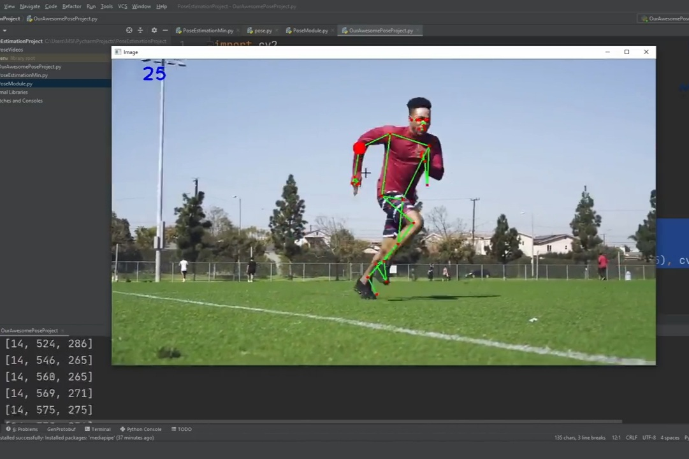
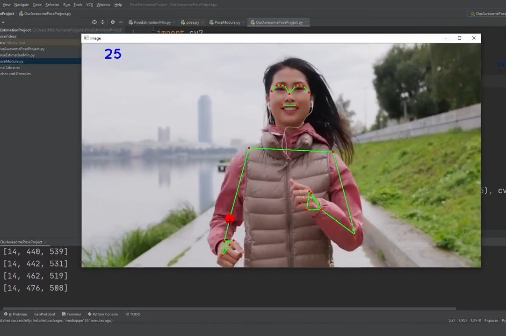
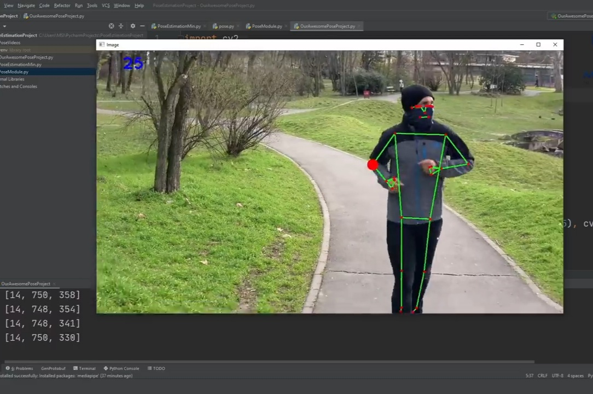
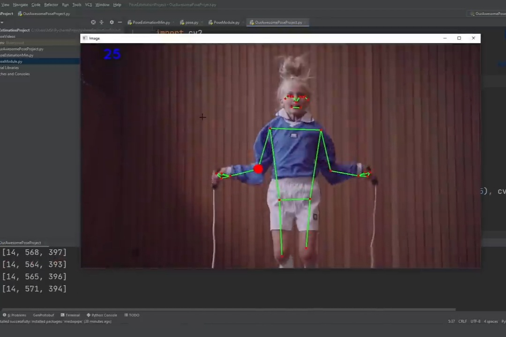
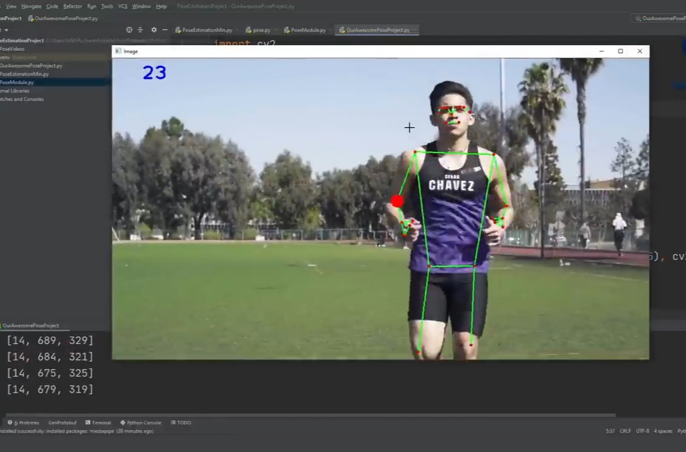
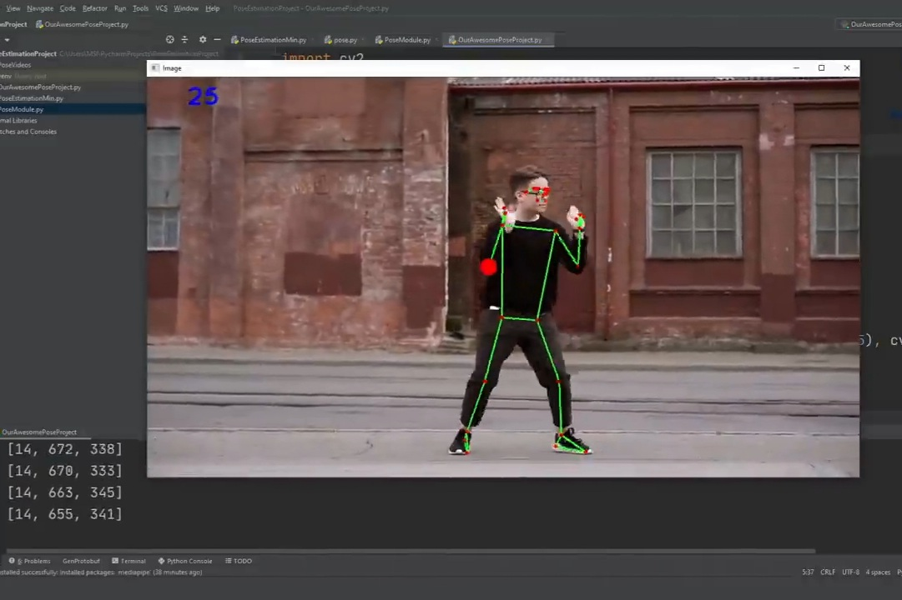
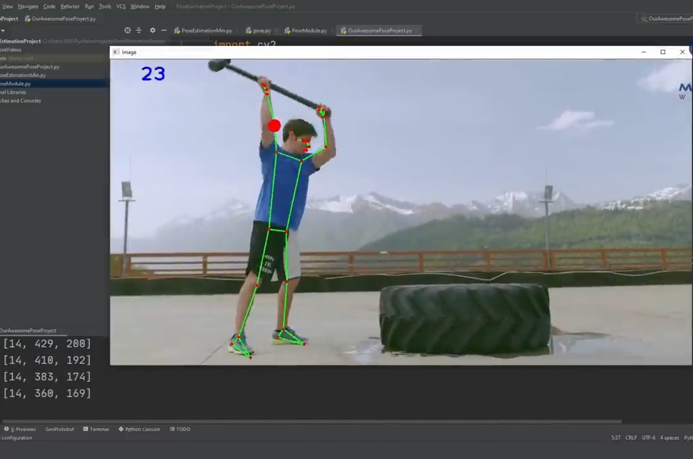
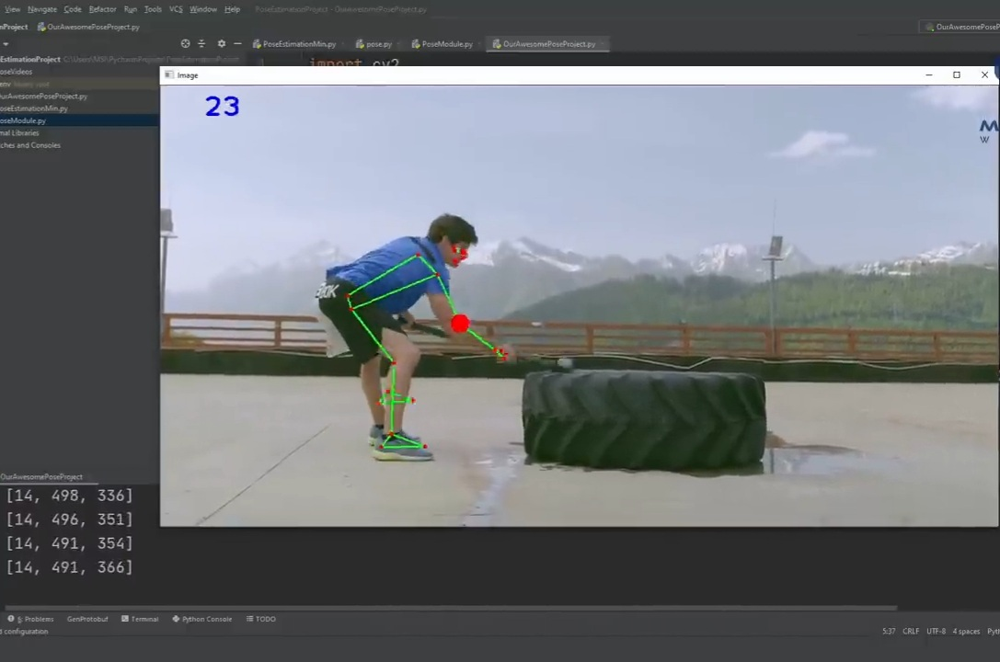

## Computer Vision Based Pose Estimation

This model demonstrates real-time human pose estimation using Python. This is done by capturing frames from videos, calculating FPS, and running MediaPipe’s pose estimation model. Landmarks (33 body keypoints) are detected in real time, drawn on the frame with connections (skeleton), and tested across multiple videos.  

### Models and libraries used
**Libraries:  
OpenCV (cv2)**: For video capturing, image processing, drawing text, shapes, and showing output.  
**MediaPipe:** For the pose estimation model and utilities to draw landmarks and connections.  
**time:** To calculate frames per second (FPS). 

**Model:  
MediaPipe Pose**: It is a lightweight deep learning model capable of detecting 33 landmarks on the human body. The model works with both detection and tracking modes for efficiency. Detection mode finds new poses. Tracking mode follows existing ones, saving computation.

Figure: 33 landmarks detection on the human body by MediaPipe Pose.

### Result
The final result of this model is the detection of 33 pose landmarks (joints such as nose, eyes, ears, shoulders, elbows, hips, knees, ankles, etc.) in real-time video at ~24 FPS on CPU. Skeleton connections are drawn between the landmarks. This model can do smooth tracking of body joints across frames. The FPS counter shows performance, proving it runs efficiently on CPU without GPU acceleration. 

### Methodology
1. Frame Capture & FPS Calculationcv2.VideoCapture() was used to read video frames. cv2.imshow() displayed the frames. FPS was tracked using time difference between frames.
2. Pose Detection Pipeline converted BGR frames into RGB. These RGB frames were passed through mp.solutions.pose.Pose().process() in order to get 33 landmarks with (x, y, z, visibility) values. Then normalized coordinates were scaled into pixel coordinates (using image width and height).
3. mp.solutions.drawing_utils.draw_landmarks() was used for drawing landmarks, overlay joints and skeleton lines.
4. Object-Oriented Module Creation used the pipeline in a PoseDetector class with parameters for mode, upper body, smoothing, detection confidence, and tracking confidence. Methods like findPose() encapsulated the detection logic. The class was reused across test videos.  

In conclusion, this model is a real-time vision-based system to detect human joints from videos and evaluate pose using pose estimation techniques, helping users perform exercises correctly by comparing predicted postures with ideal reference models. The modular class (PoseDetector) makes it simple to reuse the code for future projects like gesture recognition, fitness tracking or AR applications.
